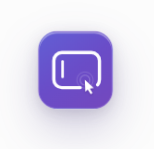
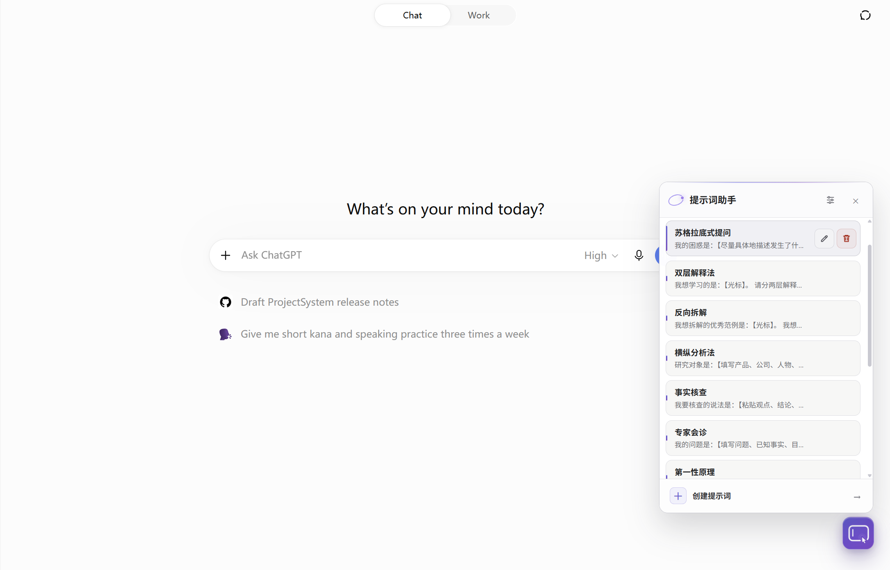
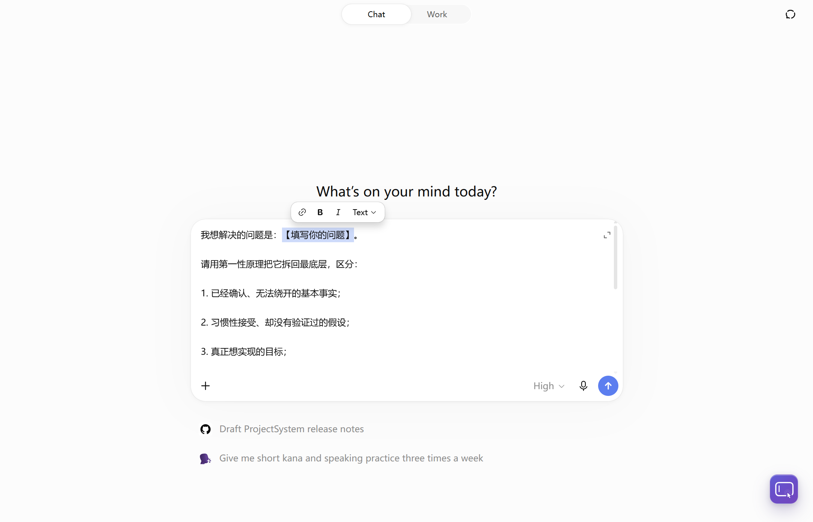

<div align="center">
  
  <h1>ChatGPT 提示词助手</h1>
  <p>在 ChatGPT 网页版集中管理常用提示词，一键插入，并把光标或选区准确放到需要填写的位置。</p>
  <p><strong>本地存储 · 零运行依赖 · 不联网 · 不自动发送</strong></p>
</div>



<p align="center"><sub>Quiet Orbit 界面：提示词面板、插入设置与可拖动浮动入口。</sub></p>

## 它解决什么问题

反复复制长提示词时，真正麻烦的往往不是粘贴，而是每次都要找到并改掉其中的“主题”“对象”或“要求”。本扩展把提示词保存在浏览器本地；点击卡片即可插入，并自动定位到第一个待填写位置，让下一次键盘输入直接完成替换。

## 特性

- Quiet Orbit（静默轨道）界面以克制的浮动入口和紧凑面板管理提示词
- 浮动按钮一键唤出提示词面板，默认位于网页右下角
- 在当前光标位置插入提示词，不覆盖已有内容，也不自动发送
- 支持占位符自动定位光标（默认 `【光标】`，兼容 `[光标]`，也可自定义）
- 默认自动选中正文中第一处 `【任意内容】`，输入即可整体替换，可在插入设置中关闭
- 提示词支持新增、编辑、删除、拖动排序和本地持久化
- 浮动按钮支持拖拽，位置自动保存
- 浅色、深色与系统主题自适应，编辑和删除图标会同步切换颜色
- 在细指针设备上，提示词卡片悬停时显示编辑和删除图标；触屏设备始终显示这些操作
- 支持 `prefers-reduced-motion` 和键盘操作（Esc 关闭、Tab 焦点循环）
- 零运行依赖，不联网，不读取 API Key，不上传提示词或聊天内容

## 快速体验

保存下面这条提示词：

```text
请面向【目标读者】，用简洁的语言解释【主题】，并给出三个例子。
```

点击提示词卡片后，正文会插入 ChatGPT 输入框，并自动选中第一处 `【目标读者】`。此时直接输入即可整体替换这段文字；同一条提示词中的后续 `【主题】` 保持不变，方便继续填写。



<p align="center"><sub>插入效果：第一处全角中括号占位符保持在正文中并被整体选中，可直接输入替换。</sub></p>

如果模板使用的是 `【光标】`、`[光标]` 或自定义光标占位符，命中的标记会被移除，光标停在原位置。两种模式可以共存，并按固定优先级避免冲突。

## 安装

本扩展暂未上架 Chrome Web Store。Windows 上的正式版 Chrome **不能**靠一行命令、拖入 `.crx` 或 `--load-extension` 装进你正在使用的浏览器配置。可靠做法只有一种：把源码放到本地文件夹，再在 Chrome 里 **加载已解压的扩展程序**。

本地编程 Agent（Cursor、Claude Code、Codex、本机 Grok 等）可以替你下载源码，**不能**替你点完 Chrome 里的加载步骤。网页里的 ChatGPT / Grok 对话既没有磁盘权限，也进不了 `chrome://extensions/`，请不要把下面的 Agent 提示词发给它们。

### 手动安装

先取得源码，二选一即可。

**用 Git：**

```text
git clone https://github.com/issacsmit/Prompt_Helper_Extension_for_ChatGPT.git
```

记住这个文件夹的位置。以后更新时，必须在**同一个**文件夹里执行 `git pull`，不要重新克隆一份。

**用 ZIP：**

1. 打开仓库页面：<https://github.com/issacsmit/Prompt_Helper_Extension_for_ChatGPT>
2. 点击绿色的 **Code** → **Download ZIP**
3. 解压到一个你找得到、以后也不会随便挪走的位置，例如 `Documents\Prompt_Helper_Extension_for_ChatGPT`
4. 解压后常会多一层 `Prompt_Helper_Extension_for_ChatGPT-main`。最终要加载的，是**里面直接含有 `manifest.json` 的那一层**，不要选到更外层的空壳目录，也不要选 `tests`、`docs` 或 `icons`

无论用哪种方式，打开该文件夹应能直接看到 `manifest.json`、`content.js`、`ui.js`、`content.css`。这就是扩展的当前根目录。

然后在 Chrome 里加载：

1. 地址栏进入 `chrome://extensions/`（复制粘贴即可）
2. 打开右上角 **开发者模式**
3. 点击 **加载已解压的扩展程序**
4. 在文件夹对话框里选中上面的**当前根目录**（选中后应能看见 `manifest.json`），确认
5. 列表里应出现「ChatGPT 提示词助手」，状态为已启用
6. 打开或刷新 [chatgpt.com](https://chatgpt.com/)，右下角应出现蓝紫色浮动按钮

扩展卡片上通常会显示已解压的本地路径。请把这条路径记下或收藏，以后更新还要用。

**没有出现浮动按钮时，按下面检查：**

- 有没有选错目录：若提示找不到 `manifest.json`，或加载成功但 ChatGPT 里没有按钮，多半选到了上一级或子目录
- 当前标签是不是 `https://chatgpt.com/...`；`chat.openai.com` 或其它站点不会注入
- 已经打开的 ChatGPT 标签在加载扩展**之后**是否刷新过；不刷新则页面里仍没有 content script
- 扩展页是否出现重复的「ChatGPT 提示词助手」。若有两个，关掉或移除多出来的，只保留一份，避免两个浮钮、两套数据

### 用本地 Agent 下载源码

把下面整段复制到**能读写磁盘的**编程助手。这是独立任务，不依赖任何旧对话。Agent 完成后，你仍须按上一节的第 1–6 步在 Chrome 里加载。

```text
请把 Chrome 扩展「ChatGPT 提示词助手」的源码下载到这台电脑。

仓库：https://github.com/issacsmit/Prompt_Helper_Extension_for_ChatGPT.git

要求：
1. 若当前目录已经是该仓库（存在 manifest.json，且其中 "name" 为「ChatGPT 提示词助手」），不要再克隆一份，直接告诉我这个目录的绝对路径。
2. 否则用 git clone 克隆到用户主目录下容易找到的位置；若没有 git，再下载仓库 ZIP 并解压。
3. 克隆或解压完成后，确认该目录的第一层就有 manifest.json、content.js、ui.js、content.css。若多出 *-main 这一层，以含 manifest.json 的那一层为准。
4. 不要执行 npm install（本项目无运行依赖）。不要用 --load-extension、不要操作 Chrome、不要打开 chrome://extensions/、不要模拟点击「加载已解压的扩展程序」。Chrome 不允许脚本把扩展写进用户正在使用的浏览器配置。
5. 完成后只输出：
   - 扩展根目录的绝对路径
   - 请用户打开 chrome://extensions/，开启开发者模式，点击「加载已解压的扩展程序」，选择刚才这个根目录
   - 请用户打开或刷新 https://chatgpt.com/ ，右下角应出现浮动按钮
   - 请用户保存这个绝对路径，以后更新要用；更新时请使用本仓库 README 里的「用本地 Agent 更新」提示词，不必假设还在这次对话里
```

## 更新

加载已解压的扩展**不会**随 GitHub 自动更新。你改完磁盘上的文件后，还要让 Chrome 和已经打开的页面都换上新脚本。

1. 更新文件夹里的源码（下一节二选一）
2. 打开 `chrome://extensions/`，在「ChatGPT 提示词助手」卡片上点 **重新加载**
3. 刷新已经打开的 ChatGPT 标签。只重新加载扩展、不刷新页面，标签里仍运行旧版 content script

不要再次「加载已解压的扩展程序」来更新，否则会装成第二份。

**Git 安装的更新：** 在当初 clone 的那个目录执行 `git pull`。

**ZIP 安装的更新：** 重新下载 ZIP，解压后把**新的文件覆盖进 Chrome 正在加载的那个根目录**（路径可在扩展卡片上核对），不要解压成另一个新文件夹再加载一次。

### 用本地 Agent 更新

更新是另一次独立任务。不要假设用户还在「帮我下载」的那次对话里，也不要假设 Agent 记得路径。把下面整段复制给能读写磁盘的编程助手。

```text
请更新这台电脑上已经在用的 Chrome 扩展「ChatGPT 提示词助手」（仓库 https://github.com/issacsmit/Prompt_Helper_Extension_for_ChatGPT）。

这不是新安装。用户可能早在别的对话、别的工具里下载过源码，你未必知道目录在哪。

请按这个顺序做：
1. 先问用户：Chrome 里加载的扩展根目录绝对路径是什么？可提示他们到 chrome://extensions/ 打开该扩展卡片，抄下已解压路径。
2. 若用户暂时给不出路径，再在常见位置搜索：目录中同时存在 manifest.json、content.js、ui.js，且 manifest.json 的 "name" 为「ChatGPT 提示词助手」。找到多个就列出来让用户选，不要擅自挑一个覆盖。找不到就停下来，让用户改用 README 的手动更新步骤。
3. 确认目标目录后：
   - 若该目录是 git 仓库且 remote 指向上述 GitHub 仓库：在该目录 git pull，不要在别处重新 clone。
   - 若不是 git 仓库：下载该仓库最新源码，把文件覆盖进这个已有目录，保持 Chrome 正在加载的路径不变。不要新建第二个文件夹，不要再次执行「加载已解压的扩展程序」。
4. 不要执行 npm install。不要用命令行给正在运行的 Chrome 热加载扩展。不要打开或操作 chrome:// 页面。
5. 完成后只输出：
   - 实际更新了哪一个绝对路径
   - 请用户到 chrome://extensions/ 对本扩展点「重新加载」
   - 请用户刷新已经打开的 ChatGPT 标签（只 reload 扩展不够）
   - 若 git pull 显示已经是最新，也仍然提醒这两步，以免页面里还是旧脚本
```

## 使用

1. 点击页面右下角的浮动按钮，打开提示词面板
2. 点击新增入口，填写提示词名称、内容和可选的自定义占位符
3. 把 ChatGPT 输入框的光标放到目标位置
4. 点击面板中的提示词卡片，将内容插入当前光标位置
5. 使用卡片上的铅笔或垃圾桶图标编辑、删除提示词
6. 按住词条左侧六点手柄拖动可调整顺序，刷新后保持；焦点在手柄上时也可用方向键上下移动。细指针设备上也可按住词条正文拖动，松开后不会误插入。触屏请用左侧手柄拖动，以免和列表滚动冲突
7. 按住浮动按钮拖动可调整位置；刷新页面后会恢复保存的位置

### 占位符

- 默认占位符：`【光标】`
- 兼容旧占位符：`[光标]`
- 可为每条提示词设置任意自定义字符串，例如 `<继续写>`
- `【光标】`、`[光标]` 和自定义光标占位符命中后会被移除，并把光标移动到该位置
- 没有命中上述光标占位符时，默认选中正文中第一处全角中括号占位符，例如 `【主题】`；用户直接输入即可替换整个 `【主题】`
- 同一条提示词包含多处 `【…】` 时只选中第一处，其余内容保持不变
- 点击面板标题栏的“插入设置”按钮，可关闭或重新开启 `【…】` 自动选中
- 冲突优先级固定为：当前提示词的自定义光标 → `【光标】` / `[光标]` → 第一处 `【…】` → 历史兼容占位符；没有实际命中的规则不会阻挡后续规则
- 最近使用的自定义占位符会自动去重并保留最多 5 条，可点击复用或单独删除

## 技术栈

- Chrome Extension Manifest V3
- 原生 JavaScript（content script，无构建步骤）
- 原生 CSS（无框架）
- Node.js 内置测试器

## 目录结构

```text
.
├── manifest.json        # 扩展清单、权限与脚本加载顺序
├── constants.js         # 常量与存储键
├── storage.js           # chrome.storage.local 访问与同步
├── prompt-engine.js     # 占位符匹配与光标位置计算
├── chatgpt-editor.js    # ChatGPT 输入框定位与插入适配
├── ui.js                # 面板、对话框、CRUD 与拖拽
├── content.js           # 初始化、单例与 SPA 生命周期
├── content.css          # 明暗主题与组件样式
├── icons/               # 扩展图标（16 / 48 / 128）
├── docs/images/         # README 产品截图
├── tests/               # 自动化测试与本地浏览器 fixture
├── DEVELOPMENT.md       # 架构和维护说明
└── TEST_CHECKLIST.md    # 真实页面人工回归清单
```

## 数据结构

数据存储于 `chrome.storage.local`：

| Key | 说明 |
| --- | --- |
| `ph_prompts` | 提示词列表 |
| `ph_placeholder_history` | 最近使用的自定义占位符，最多 5 条 |
| `ph_button_pos` | 浮动按钮位置 |
| `ph_auto_select_bracket_placeholder` | 是否自动选中第一处 `【…】`，缺失时默认开启 |

单条提示词示例：

```json
{
  "id": "timestamp+random",
  "name": "用户自定义名称",
  "prompt": "提示词内容，可含【光标】占位符",
  "placeholder": "【光标】"
}
```

## 隐私与权限

- 扩展只声明 `storage` 权限，仅在 chatgpt.com（`https://chatgpt.com/*`）页面运行
- 提示词、占位符历史和浮动按钮位置只保存在 Chrome 本地扩展存储中
- 扩展不发起网络请求，不调用模型服务，也不读取或保存 API Key
- 扩展不会上传提示词或聊天内容；插入后是否发送始终由用户决定
- 本项目不隶属于 OpenAI；“ChatGPT”只用于说明适配的网页产品

## 开发

项目无构建步骤、无第三方运行依赖。修改代码后：

1. 在 `chrome://extensions/` 中点击本扩展的 **重新加载**
2. 刷新已经打开的 ChatGPT 页面
3. 执行完整自动化验证：

   ```text
   npm test
   npm run check
   npm run verify
   ```

`npm run verify` 会先检查生产与测试 JavaScript 语法，再运行 Node.js 全量测试。项目不需要执行 `npm install`。

更多实现细节见 [DEVELOPMENT.md](DEVELOPMENT.md)，真实 ChatGPT 页面回归步骤见 [TEST_CHECKLIST.md](TEST_CHECKLIST.md)。本地合成页面可通过 `tests/fixtures/chatgpt-composer.html` 验证 CRUD、插入、主题、拖拽和 SPA 重建流程。
